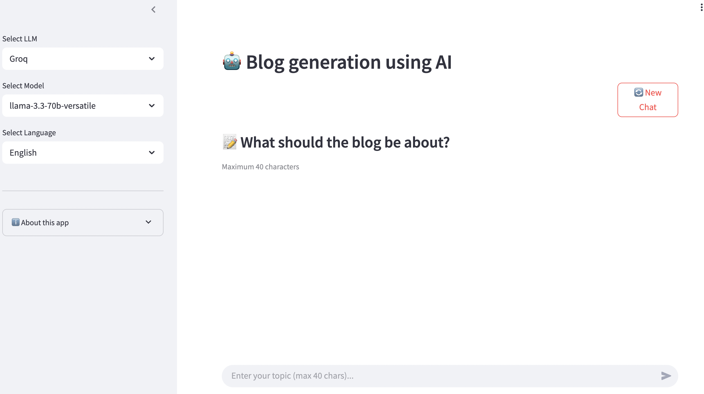
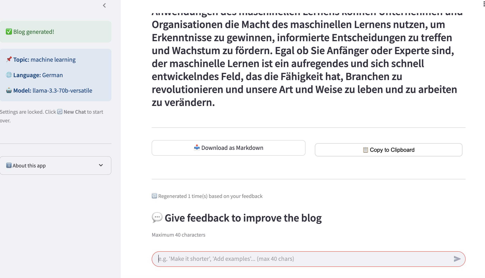
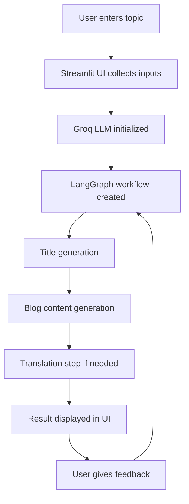

# AI Blog Generator Agent

AI Blog Generator Agent is an end-to-end LLM application that turns a short topic into a full blog post, then lets the user refine the output through a feedback loop. The project is built with LangGraph for workflow orchestration, Groq for fast inference, Streamlit for the UI, and Docker for deployment on Hugging Face Spaces.

## Live Demo

- Live app: [Hugging Face Space](https://huggingface.co/spaces/NitinSharmaDS/blog-generator-agent)

## Demo Preview

The app supports a simple end-to-end workflow:

- choose the LLM, model, and language
- enter a topic and generate a full blog draft
- regenerate the result with short follow-up feedback
- download the final blog as Markdown or copy it to the clipboard

## Screenshots

### Home Screen

Shows the clean app layout with Groq model selection, language controls, and topic input.



### Feedback And Export Flow

Shows the generated blog state with Markdown export, clipboard copy, and the feedback input used to regenerate the content.



## Why This Project Matters

This project goes beyond a basic chatbot demo. It shows how to:

- build a real AI workflow with multiple steps
- orchestrate generation logic using LangGraph
- create an interactive product UI with Streamlit
- validate user input and add simple rate limiting
- package and deploy the app publicly with Docker

For a portfolio, that makes it a solid starter AI project because it demonstrates both application development and deployment.

## Features

- Generate a complete blog from a short topic
- Regenerate content based on user feedback
- Support multiple output languages
- Download the generated blog as Markdown
- Copy blog content directly to the clipboard
- Add basic guardrails with input validation and cooldown logic

## Tech Stack

- Python
- Streamlit
- LangGraph
- LangChain
- Groq LLM
- Docker
- Hugging Face Spaces

## Problem Statement

Writing a first draft for a blog often takes time, especially when the user only has a rough topic idea. This project solves that by generating a structured first version quickly and allowing iterative improvement through follow-up feedback.

## How It Works

At a high level, the app takes a topic, builds a generation workflow, creates blog content, and optionally refines or translates the output based on the selected language and user feedback.



## Example User Flow

1. Enter a topic such as `How AI is changing education`.
2. Choose a target language.
3. Generate the first blog draft.
4. Add feedback such as `make it shorter` or `add examples`.
5. Regenerate the blog with improved output.

## Sample Prompts

- `Benefits of learning Python for beginners`
- `Impact of AI in healthcare`
- `How remote work is changing startups`
- `Beginner guide to machine learning`
- `Future of electric vehicles in Europe`

## Project Structure

```text
BlogAgentic/
├── app.py                 # Streamlit app entrypoint used in Docker/Spaces
├── main.py                # Local convenience entrypoint
├── Dockerfile             # Container setup for deployment
├── requirements.txt       # Python dependencies
├── src/
│   ├── main.py            # Core app flow
│   ├── graphs/            # LangGraph workflow builder
│   ├── llms/              # Groq LLM integration
│   └── ui/streamlitui/    # Streamlit UI components
└── README.md
```

## Local Setup

```bash
git clone <your-repo-url>
cd BlogAgentic
pip install -r requirements.txt
```

Create a `.env` file and add your key:

```env
GROQ_API_KEY=your_api_key_here
```

Run the app locally:

```bash
streamlit run app.py
```

Then open:

```text
http://localhost:8501
```

## Docker Run

Build the image:

```bash
docker build -t blog-agentic .
```

Run the container:

```bash
docker run -p 7860:7860 --env-file .env blog-agentic
```

Then open:

```text
http://localhost:7860
```

Note: `0.0.0.0:7860` is the server bind address inside the container. In the browser, use `localhost:7860` locally or the Hugging Face Space URL after deployment.

## Deployment

This project is deployed on Hugging Face Spaces using:

- `sdk: docker`
- container port `7860`
- Streamlit running with `--server.address=0.0.0.0`

The Docker container starts the Streamlit app through `app.py`, which is the correct entrypoint for the deployed UI.

## Challenges Solved

- Aligning local Streamlit behavior with Hugging Face Spaces deployment
- Running the app on the required container port
- Handling input validation and user cooldowns
- Keeping the UI simple while still supporting iterative generation

## Potential Improvements

- Add blog tone or writing-style presets
- Save blog generation history
- Add authentication and per-user sessions
- Add automated tests for graph flow and validation logic
- Add richer formatting options for exported content
- Add screenshots or a short GIF demo to improve the portfolio presentation further

## What I Learned

This project helped me practice:

- designing an AI workflow instead of a single prompt call
- integrating LLMs into a usable web interface
- debugging Docker deployment issues
- preparing an AI project for public hosting

## Demo Assets To Add Next

To make the portfolio presentation even stronger, the next simple upgrade is to add:

- a short GIF showing topic input, generation, and feedback regeneration
- a GitHub repository link near the top of this README
- the four screenshots listed above under an `assets/screenshots/` folder

## License

MIT
